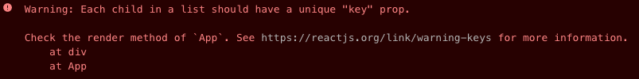

<h1 align="center">React project use UUID</h1>
<div align="center">2021.01.12</div>

::: tip Contents
[[toc]]
:::

## 🚀 Demo

<iframe src="https://codesandbox.io/embed/uuid-showcase-q8feb?fontsize=14&hidenavigation=1&theme=dark&view=preview"
     style="width:100%; height:200px; border: 1px lightgray solid; border-radius: 10px; overflow:hidden; margin-top: 20px;"
     title="UUID Showcase"
     allow="accelerometer; ambient-light-sensor; camera; encrypted-media; geolocation; gyroscope; hid; microphone; midi; payment; usb; vr; xr-spatial-tracking"
     sandbox="allow-forms allow-modals allow-popups allow-presentation allow-same-origin allow-scripts"
   ></iframe>

## 🎮 Usage

When we want to iterate list-items in react-app, the **ID** for each list-item must be unique, otherwise, we will get a warning in the console. By UUID, we can get unique IDs easily.



## 🎯 Goal

Create a simple list by React. Retrive the list-items, use UUID to generate unique IDs.

## 🦶🏻 Steps

### Step 0. Create a simple list

1. Create a new single-page app in React by `npx create-react-app [my-app]`.
2. Create a simple list and each list-item with _id_ and _title._ The _id_ can be written in static number for now, but it must be different from each other.
3. Iterate the list-items to display the result on DOM.

```jsx
import React from 'react';
import './styles.css';

export default function App() {
  const todoList = [
    {
      id: 0,
      title: 'switch',
    },
    {
      id: 1,
      title: 'xbox',
    },
    {
      id: 2,
      title: 'ps5',
    },
  ];

  return (
    <div className="App">
      <h4>UUID</h4>

      {todoList.map((todo) => (
        <div key={todo.id}>{todo.title}</div>
      ))}
    </div>
  );
}
```

### Step 1. Install and import UUID

```bash
$ npm i uuid
```

- import UUID where we need to generate uniqu IDs.

```jsx
import { v4 as uuid } from 'uuid';
```

### Step 2. Implement UUID to project

- `uuid()`: UUID will generate unique ID by implement the function.
- Unique Id: e.g. _95ec0aaa-9a78-492a-ab3b-64de01dbde94_

```jsx{3,7,11}
const todoList = [
  {
    id: uuid(),
    title: 'switch',
  },
  {
    id: uuid(),
    title: 'xbox',
  },
  {
    id: uuid(),
    title: 'ps5',
  },
];
```
